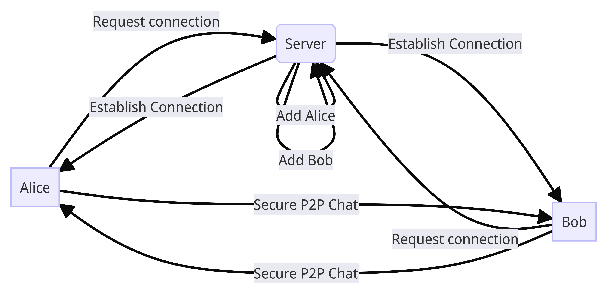

<a name="readme-top"></a>

<div align="center">
  <h3 align="center">P2P Chat App using Holepunch</h3>
</div>

[](https://youtu.be/vt5fpE0bzSY)


## About the App

A Peer-to-Peer (P2P) chat application, built with Holepunch, Hyperbee, and HyperDHT. This app enables secure and private communications without relying on a central server or third-party service.

At its core, Holepunch is used for bypassing network complexities, creating direct, decentralized connections between users. HyperDHT, a DHT (Distributed Hash Table) implementation, manages peer and socket connections effectively, while Hyperbee handles our data storage needs with efficiency and integrity.

Our chat app ensures end-to-end security with robust encryption, protecting your conversations from prying eyes. The use of Hyperbee reduces the risk of data breaches, as it removes the need for central data storage.

### Demo: https://youtu.be/vt5fpE0bzSY

<p align="right">(<a href="#readme-top">back to top</a>)</p>


## Key Features

- Peer-to-Peer Communication
- Managed Connections
- Secure Conversations

## Tech Stack

- NodeJS
- Holepunch
- Hypercore
- Hyperbee
- HyperDHT

<p align="right">(<a href="#readme-top">back to top</a>)</p>

## Getting Started

### Prerequisites
Install [Node.js and npm](https://nodejs.org/en/download/)

### Setup

Clone the repo
```sh
git clone https://github.com/guptaharsh13/luganodes-task
```

Change into the directory, and install the required dependencies
```shell
cd luganodes-task
cd backend
npm i
cd ../frontend
npm i
  ```

<p align="right">(<a href="#readme-top">back to top</a>)</p>

## Usage

### Local Run

Start the server instance
```sh
cd backend
npm start
OR
npm run dev (for development environment)
```

You may spin up multiple client instances
```sh
cd frontend
npm start
```

### Docker Run

Start the server instance
```sh
cd backend
docker build -t chat-backend .
docker run -it chat-backend
```

You may spin up multiple client instances
```sh
cd frontend
docker build -t chat-backend .
docker run -it chat-backend
```

<p align="right">(<a href="#readme-top">back to top</a>)</p>

## Folder Structure
```
.
├── LICENSE.txt
├── README.md
├── architecture.svg
├── backend
│   ├── Dockerfile
│   ├── app.js
│   ├── package-lock.json
│   └── package.json
└── frontend
    ├── Dockerfile
    ├── app.js
    ├── package-lock.json
    └── package.json
```

<p align="right">(<a href="#readme-top">back to top</a>)</p>

## Limitations

The frontend of the application could not be developed using React due to an existing constraint. Our reliance on HyperDHT to handle P2P and encrypted socket connections poses a significant hurdle as it lacks browser support, thus making it incompatible with React-based implementation.

## Possible Solution

Contrary to initial impressions, the lack of browser compatibility with HyperDHT doesn't prevent us from crafting the frontend of our application in React. To overcome this, we need a connection handling mechanism that mirrors HyperDHT’s functionalities, yet is inherently designed for browser-based environments.

By creating a solution that emulates HyperDHT's capabilities but is tailored for browser compatibility, we're able to build a robust P2P chat application. This application combines the sophisticated UI potential of React for frontend development with a browser-friendly implementation for secure, P2P connections, analogous to the service offered by HyperDHT.

<p align="right">(<a href="#readme-top">back to top</a>)</p>

## Contributing

Contributions are what make the open source community such an amazing place to learn, inspire, and create. Any contributions you make are **greatly appreciated**.

If you have a suggestion that would make this better, please fork the repo and create a pull request. You can also simply open an issue with the tag "enhancement".
Don't forget to give the project a star! Thanks again!

1. Fork the Project
2. Create your Feature Branch (`git checkout -b feature/AmazingFeature`)
3. Commit your Changes (`git commit -m 'Add some AmazingFeature'`)
4. Push to the Branch (`git push origin feature/AmazingFeature`)
5. Open a Pull Request

<p align="right">(<a href="#readme-top">back to top</a>)</p>

<!-- LICENSE -->

## License

Distributed under the MIT License. See `LICENSE` for more information.

<p align="right">(<a href="#readme-top">back to top</a>)</p>

<!-- CONTACT -->

## Contact

Harsh Gupta - hg242322@gmail.com

GitHub Link: [https://github.com/guptaharsh13](https://github.com/guptaharsh13)

<p align="right">(<a href="#readme-top">back to top</a>)</p>

<p align="center">Made with ❤ by Harsh Gupta</p>
